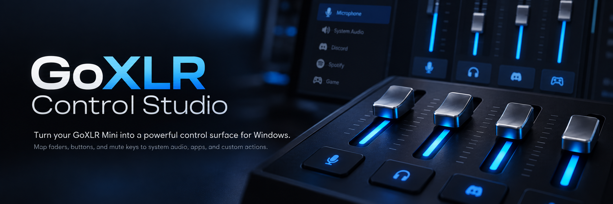

<p align="center">
  
</p>

# GoXLR Control Studio

Inoffizielle Windows-Desktop-App, die eine **TC-Helicon GoXLR Mini** über die [GoXLR Utility](https://github.com/GoXLR-on-Linux/goxlr-utility) als programmierbare Control Surface nutzt — Fader, Buttons und Mute-Tasten für System-Audio, Apps und eigene Aktionen.

> Nicht affiliated mit TC-Helicon / Music Tribe oder dem GoXLR Utility Projekt.

## Was es tut

- Fader steuern Windows-Master- und Anwendungs-Lautstärke
- Buttons lösen Mute, Media-Keys, Shortcuts (z. B. Discord Mute/Deafen) aus
- LED-Feedback am Gerät (Status / Peak-Proxy, optional exklusiv)
- Profile lokal speichern; Auto-Update über Velopack (GitHub Releases)
- **Kein** Audio-Routing über die GoXLR erforderlich

## Voraussetzungen

1. Windows 10/11 x64
2. Offizielle GoXLR-Treiber (bereits vorhanden, wenn Official App je installiert war)
3. [GoXLR Utility 1.2.4+](https://github.com/GoXLR-on-Linux/goxlr-utility/releases) — **nicht** parallel zur Official App  
   Die App kann die Utility selbst installieren (winget → GitHub-Installer) und den Daemon automatisch starten. Die Utility-UI musst du nicht manuell öffnen.
4. .NET 8 (bei self-contained Build / Setup.exe nicht nötig)

## Installation (Release)

1. Neueste **Setup.exe** von [Releases](https://github.com/gerritgutzeit/goxlr-control/releases) laden (`GoXlrControlStudio-win-Setup.exe`)
2. Installieren — Updates erscheinen danach in der App als **Update**-Button

## Schnellstart (Entwicklung)

```powershell
dotnet build GoXlrControl.sln
dotnet test GoXlrControl.sln
dotnet run --project tools/GoXlrControl.DiagHost
dotnet run --project src/GoXlrControl.App
```

Simulation ohne Hardware: Settings → **Simulated Hardware** aktivieren und App neu starten. DiagHost fragt beim Start nach Simulation.

## Publish / Release

**Empfohlen (Auto-Update):** Version in der csproj bumpfen, Tag `vX.Y.Z` pushen — GitHub Actions baut Velopack-Setup und Release.

Lokal:

```powershell
.\packaging\publish.ps1
.\packaging\velopack-pack.ps1
```

Details: [`docs/planning/release-process.md`](docs/planning/release-process.md).

Legacy ohne Updater: Inno Setup 6 mit `packaging/GoXlrControlStudio.iss`.

## Bekannte Einschränkungen

- GoXLR Utility und offizielle GoXLR App schließen sich gegenseitig aus.
- Fader liefern Channel-Volumen (0–255), keine Rohachsen.
- Discord Mute/Deafen = `IDiscordIntegration` FALLBACK (Shortcut); bestätigter State nur nach Discord-Approval (HYBRID/NATIVE).
- Lighting / OBS / Auto-Profile-Switch sind Post-MVP.

## Dokumentation

Siehe [`docs/`](docs/) — Architektur, Forschung, MVP, Tests (Deutsch).

## Lizenz

Siehe `LICENSE` (MIT).
