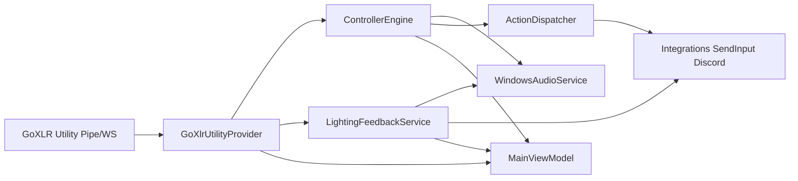

# GoXLR Control Studio — Refactoring Plan

## Executive summary (current architecture)

.NET 8 WPF app (`net8.0-windows`) composed via `Microsoft.Extensions.Hosting`. Runtime flow:



**Actual project graph** (differs from `docs/architecture/system-overview.md`): App wires everything; Engine references only HwAbs + Config; Audio and Integrations reference Engine for ports (`IVolumeSink`, `IDiscordIntegration`). Docs describe Reactive `IObservable` pipelines and split processors that were never built—code uses classic events and a monolithic `ControllerEngine`.

Scale: ~36 hand-written source files under `src/`. Largest: `MainViewModel.cs` (~682), `MainWindow.xaml` (~566), `LightingFeedbackService.cs` (~426).

---

## Important findings (evidence-backed)

### P0 — Critical stability

| ID | Finding | Evidence | Kind |
|---|---|---|---|
| **C1** | Sleep/resume can leave **two** `RunAsync` loops | `GoXlrUtilityProvider.StartAsync` always `Task.Run`s; `StopAsync` waits max 2s then continues; resume calls Stop→Start in `AppBootstrapper.OnPowerModeChanged` | **Confirmed defect** |

### P1 — Major reliability / architecture

| ID | Finding | Evidence | Kind |
|---|---|---|---|
| **C2** | `HttpDisabled` pipe poll never re-checks HTTP → stuck at 100 ms poll | `PollPipeAsync` loops until error | **Confirmed** |
| **C3** | Soft-takeover not reset after hardware resync (doc requires it) | `event-processing.md` vs reset only in `SetProfile` (`ControllerEngine.cs`) | **Confirmed** (doc/behavior gap; volume jump risk) |
| **C4** | Pipe poll can miss short button presses | 100 ms sample interval | **Confirmed limitation** of poll path |
| **C6** | Concurrent `PublishStatusAsync` via fire-and-forget WS handler mutates non-thread-safe dictionaries | `_ws.StatusUpdated += (_, s) => _ = PublishStatusAsync(...)` | **Confirmed risk** (high confidence race) |
| **C7** | Lighting `RequestForceRewrite` clears dictionaries while `TickAsync` mutates them | `LightingFeedbackService` | **Confirmed risk** |
| **C8** | Corrupt profiles silently skipped; no `.bak` | `Stores.cs` vs error-handling docs | **Confirmed** vs documented intent |

### P2 — Maintainability / performance / quality

| ID | Finding | Evidence | Kind |
|---|---|---|---|
| **P2a** | No fader coalesce (doc: 8–16 ms latest-wins) | Every event → `async void` → WASAPI; UI uses sync `Dispatcher.Invoke` per event | Doc drift + performance |
| **P2b** | Lighting diagnostics fire every 10 Hz tick → UI thrash | `DiagnosticsChanged` each tick; VM always Invoke | Performance |
| **P2c** | `System.Reactive` referenced, unused | Engine + Hardware csproj | Dead dependency |
| **P2d** | `ButtonDebouncer` sticky after bounce reject | Rejected transition does not update state | Potential defect |
| **P2e** | Fallback Discord always reports `Connection: Disconnected` | `FallbackDiscordIntegration.CreateSnapshotLocked` | Misleading status |
| **P2f** | God `MainViewModel`; concrete Hardware/Audio in UI | Coupling | Architectural preference with real cost |
| **P2g** | Audio→Engine dependency; unused config fields (`LogLevel`, `SelectedDeviceSerial`) | csproj + Models | Maintainability |
| **P2h** | Thin tests: no Engine orchestration, no Audio, no provider lifecycle | 7 test files | Coverage gap |

### P3 — Optional cleanup

Unused `NullVolumeSink` field usage, Hybrid/Native throw stubs (intentional gates), doc Reactive fiction, multi-device serial unused, process-name matching uncertainty.

**Explicitly deferred (unsafe or out of scope without external deps):** Discord Hybrid/Native (partner gate), session EventContext COM shim, full Reactive rewrite, UI redesign, live hardware/OS testing. MainViewModel split deferred (P2f) until after stability waves.

---

## Concrete proposed changes

### Wave 1 — P0 hardware lifecycle

**Files:** `GoXlrUtilityProvider.cs`, `SimulatedHardwareProvider.cs`, Hardware tests

1. `StartAsync`: if a run is already active, no-op; never spawn a second loop.
2. `StopAsync`: cancel, await `_runTask` to completion (with timeout + log), dispose WS; null out task/CTS; clear fader/button caches.
3. Same Start/Stop guard on `SimulatedHardwareProvider`.
4. Characterization tests for Start→Stop→Start without double-connect storms.

### Wave 2 — P1 status serialization, soft-takeover reset, HttpDisabled re-probe, lighting sync

1. Serialize status publish so WS fire-and-forget cannot overlap dictionary mutation.
2. Engine resets soft-takeover on Connected / HttpDisabled (no force volume write).
3. `PollPipeAsync` periodically re-checks `IsHttpEnabled`; exit to reconnect via WS when enabled.
4. Protect lighting colour caches with a shared lock.

### Wave 3 — Engine fader coalesce + debounce fix + Engine integration tests

1. Coalesce fader applies: latest-wins ~12 ms window per fader before WASAPI write.
2. Fix `ButtonDebouncer`: always accept release; debounce only press edges.
3. Engine tests with fake hardware + recording volume sink.

### Wave 4 — UI thrash, Discord honesty, dead package, config harden

1. UI: `BeginInvoke` / `InvokeAsync` for high-frequency events; lighting diagnostics only on change.
2. Align Discord Fallback connection/test naming with Mirrored semantics; document API still Disconnected.
3. Remove unused `System.Reactive` package references.
4. Corrupt profile load: rename unreadable file to `.bak` before skip.

### Wave 5 — Report and doc alignment

1. Sync `system-overview.md` dependency diagram with actual graph.
2. Note coalesce as implemented in `event-processing.md`.
3. Write `REFACTORING_REPORT.md` with verified commands/results only.

---

## Risks and possible behavioral regressions

- Resume reconnect may take longer if Stop awaits a stuck pipe connect—mitigated by CTS cancellation.
- Soft-takeover reset after sleep may require users to re-cross fader (safer than volume jump).
- HttpDisabled→WS upgrade could briefly reconnect; acceptable.
- Coalesce adds ≤12 ms latency under fast sweeps (within documented budget).
- Config `.bak` behavior must not delete user profiles.

## Validation requirements

```powershell
dotnet build GoXlrControl.sln -c Release
dotnet test GoXlrControl.sln -c Release --nologo
```

No live GoXLR, no OS default-device changes, no Discord Partner APIs. Hardware-dependent behavior remains documented as untested on device.

## Recommended implementation order

1. Write this plan (`REFACTORING_PLAN.md`)
2. Wave 1 (P0 Start/Stop)
3. Wave 2 (serialize / soft-takeover / HttpDisabled / lighting lock)
4. Wave 3 (coalesce / debounce / Engine tests)
5. Wave 4 (UI thrash / Discord honesty / Reactive removal / corrupt `.bak`)
6. Wave 5 (`REFACTORING_REPORT.md` + minimal architecture doc sync)
