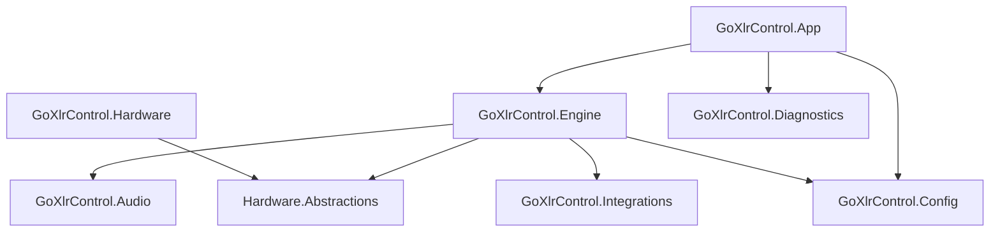

# Systemübersicht

## Zielbild

GoXLR Control Studio ist eine lokale Windows-Desktop-App, die die GoXLR Mini über die GoXLR Utility als Hardware-Controller nutzt und Windows-Audio sowie Shortcuts steuert — ohne Audio über die Mini zu routen.

## Modulgrenzen

## Laufzeitfluss

1. Host startet Services (Hardware-Provider, Audio, Engine, Tray).
2. Provider verbindet Pipe → WS, hält Status-Cache.
3. Normalisierte Events (`FaderChanged`, `ButtonChanged`) → Engine.
4. Engine mappt über aktives Profil auf Actions.
5. Executors (Audio / SendInput / Media / Launch) führen aus.
6. UI beobachtet Engine-/Provider-State via MVVM.

## Nicht-Ziele

- Virtueller Audiotreiber
- Default-Device-Umleitung
- Cloud/Telemetry-Pflicht
- Direct-USB im MVP
