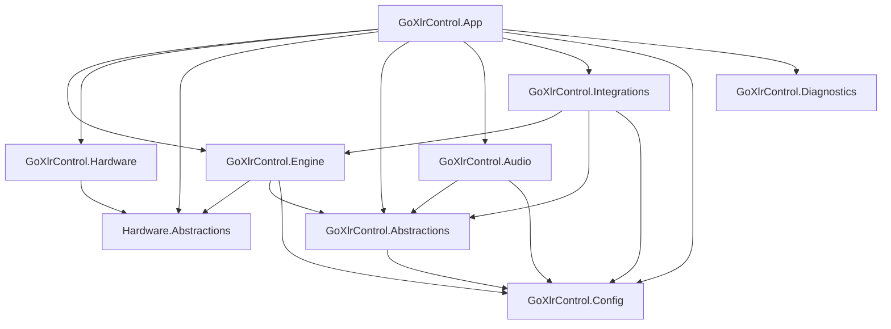

# Systemübersicht

## Zielbild

GoXLR Control Studio ist eine lokale Windows-Desktop-App, die die GoXLR Mini über die GoXLR Utility als Hardware-Controller nutzt und Windows-Audio sowie Shortcuts steuert — ohne Audio über die Mini zu routen.

## Modulgrenzen

App ist der Composition Root. `IVolumeSink` liegt in `GoXlrControl.Abstractions` (Audio implementiert, Engine/Integrations konsumieren). Discord-Ports bleiben vorerst in Engine (gated Fallback).

## Laufzeitfluss

1. Host startet Services (Hardware-Provider, Audio, Engine, Tray).
2. Provider verbindet Pipe → WS (oder Pipe-Polling bei HttpDisabled), hält Status-Cache.
3. Normalisierte Events (`FaderChanged`, `ButtonChanged`) → Engine.
4. Engine mappt über aktives Profil auf Actions (Fader mit Coalesce ~12 ms latest-wins).
5. Executors (Audio / SendInput / Media / Launch) führen aus.
6. UI beobachtet Provider-/Engine-/Lighting-Events via MVVM (`Dispatcher.InvokeAsync`).

## Nicht-Ziele

- Virtueller Audiotreiber
- Default-Device-Umleitung
- Cloud/Telemetry-Pflicht
- Direct-USB im MVP
